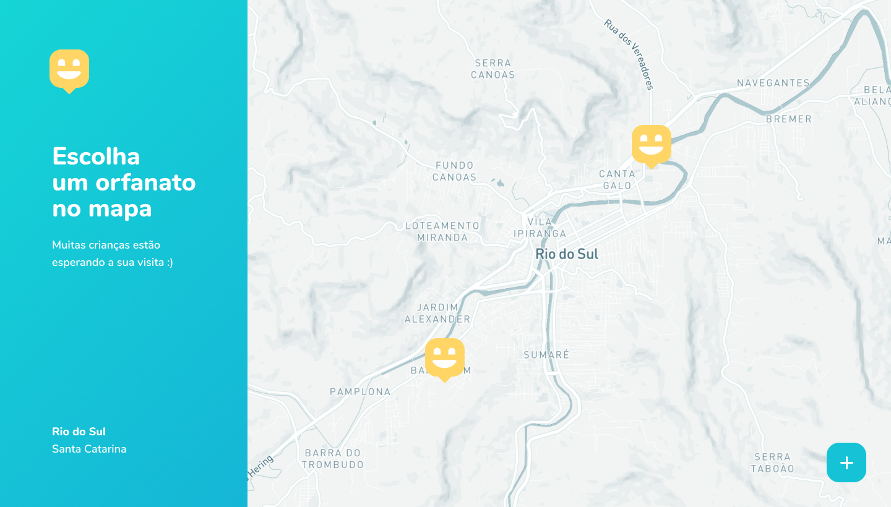

#  happy
O happy tem o propósito de conectar as pessoas com lares temporários para crianças.

Desenvolvido com Node.js, React e Reactive Native durante a Next Level Week #3 da [RocketSeat 🚀](https://rocketseat.com.br/)




# Web
O projeto **web** pode ser executado através do comando `yarn start`.
Necessário criar o arquivo de configuração de ambiente `web/src/.env` contendo a chave da API de mapa do Mapbox contendo a seguinte properties:

```properties
REACT_APP_MAPBOX_TOKEN=pk.eyJ1IjoiY2hhd_SUA_API_KEY
```

# Backend
O projeto **backend** pode ser executado em ambiente de desenvolvimento através do comando `yarn dev`.

**Typeorm**

Criação de uma nova migration:

```properties
yarn typeorm migration:create -n crie_sua_entidade
```

Execução de migration:

```properties
yarn typeorm migration:run
```

Reverter migration:

```properties
yarn typeorm migration:revert   
```